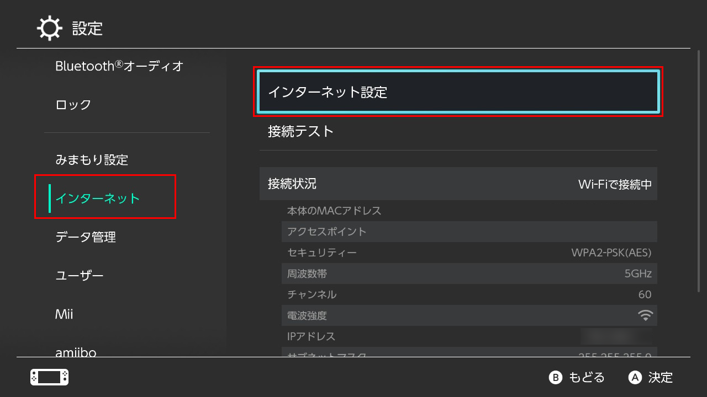
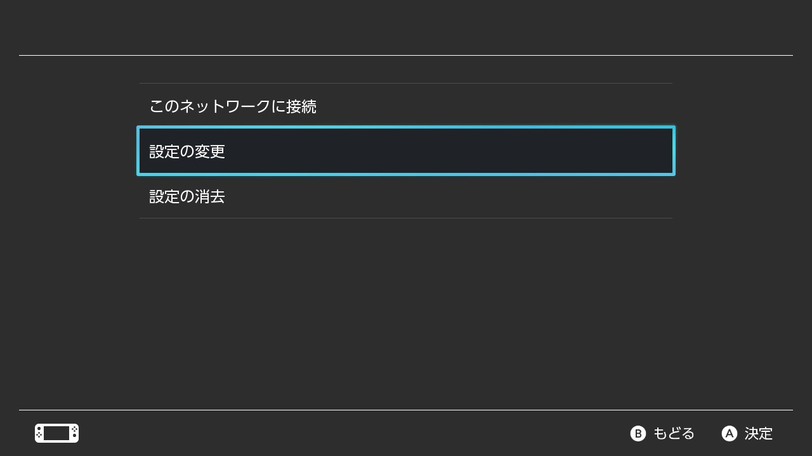
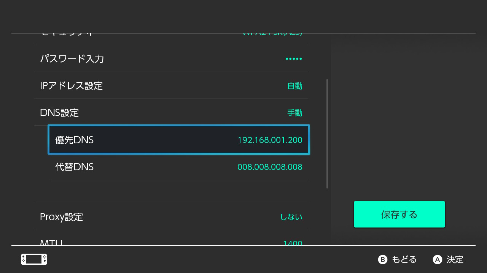
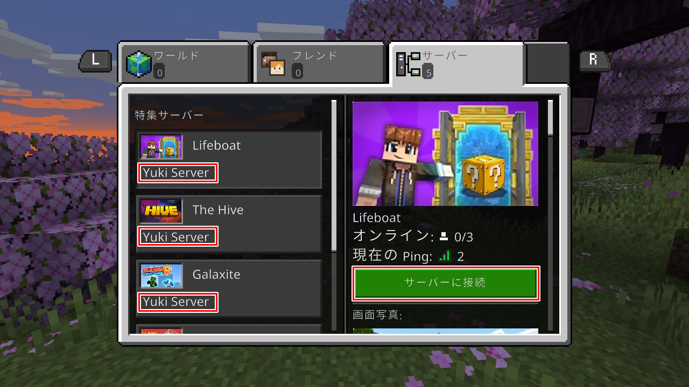

# スイッチとPCでクロスプレイ！
# 家族と遊べるサーバーの作り方

### ～ パソコン1台で構築するマイクラ統合版サーバー ～

---
layout: image-right
image: images/profile.jpg
---

# 自己紹介

- 正木裕貴（まさきゆうき）
- 愛知県在住
- ネットワークエンジニア
- [@yukiii1993](https://twitter.com/yukiii1993)

---
class: bg-blue-400
---

<div class="absolute inset-0 flex items-center justify-center text-white text-5xl">
  <div class="flex flex-col text-center">
    <div class="pb-6">
      🙄
    </div>
    <div class="p-4">
      スイッチとPCって一緒に遊べるの？
    </div>
  </div>
</div>

---
class: bg-red-400
---

<div class="absolute inset-0 flex items-center justify-center text-white text-5xl">
  <div class="flex flex-col text-center">
    <div class="pb-6">
      🤔
    </div>
    <div class="p-4">
      公式提供の特集サーバーならクロスプレイ可能！
    </div>
    <div class="p-4">
      ただし自由度はない
    </div>
  </div>
</div>

---
class: bg-green-400
---

<div class="absolute inset-0 flex items-center justify-center text-white text-5xl">
  <div class="flex flex-col text-center">
    <div class="pb-6">
      😊
    </div>
    <div class="p-4">
      自由に遊べる外部サーバーの作り方を紹介します
    </div>
  </div>
</div>

---

# 環境
- Windows10 Pro 64bit
- Ubuntu Server 22.04 LTS
- dnsmasq
- BedorockConnect 1.37
- Minecraft 1.20.15

---
layout: full
---

# 構成図



<style>
p {
  opacity: 1!important;
}
</style>

---
transition: slide-up
---

# 手順
1. [Windows] マイクラ統合版サーバーを起動する
2. [Hyper-V] 仮想マシンを作成する
3. [Ubuntu] BedrockConnectサーバーを起動する
4. [Ubuntu] ローカルDNSサーバーを起動する
5. [Switch] スイッチのネットワーク設定を変更する
6. [Swtich] 統合版サーバーに接続する

---
transition: slide-up
---

# 1. [Windows] マイクラ統合版サーバーを起動する
- 公式サイトからWindows用サーバーソフトをダウンロード
  https://www.minecraft.net/ja-jp/download/server/bedrock
- ZIPファイルを解凍して実行ファイルを起動する

---
transition: slide-up
---

# 2. [Hyper-V] 仮想マシンを作成する
- Hyper-Vがおすすめ
- 仮想マシンのスペックは1vCPU / 1GB程度でOK
- 仮想スイッチマネージャーで外部スイッチを作成する
- Ubuntu Server 22.04をインストールする
- IPを固定しておく

---
transition: slide-up
---

# 3. [Ubuntu] BedrockConnectサーバーを起動する (1/2)
- Javaをインストールする
```bash
sudo apt install -y default-jdk
```

- リポジトリからjarファイルをダウンロード
```bash
mkdir bedrock-connect
cd bedrock-connect
wget https://github.com/Pugmatt/BedrockConnect/releases/download/1.37/BedrockConnect-1.0-SNAPSHOT.jar
```

---
transition: slide-up
---

# 3. [Ubuntu] BedrockConnectサーバーを起動する (2/2)

- サーバーリストを作成する
```bash
nano server-list.json
```
JSONファイルの書式はGitHubを参照

https://github.com/Pugmatt/BedrockConnect#defining-your-own-custom-servers

- BedrockConnectサーバーを起動
```bash
java -jar BedrockConnect-1.0-SNAPSHOT.jar nodb=true custom_servers=server-list.json
```

---
transition: slide-up
---

# 4. [Ubuntu] ローカルDNSサーバーを起動する (1/2)

- ファイアウォール許可設定を追加する
```bash
sudo ufw allow 53
sudo ufw enable
```

- dnsmasqをインストールする
```bash
sudo apt install -y dnsmasq
```

- コンフィグの最下行に設定を追加する
```txt {3-}
sudo nano /etc/dnsmasq.conf

domain-needed
bogus-priv
strict-order
bind-interfaces
```

---
transition: slide-up
---

# 4. [Ubuntu] ローカルDNSサーバーを起動する (2/2)

- hostsにレコードを追加する
```bash {3-}
sudo nano /etc/hosts

192.168.1.10 geo.hivebedrock.network
192.168.1.10 play.galaxite.net
192.168.1.10 mco.mineplex.com
192.168.1.10 mco.cubecraft.net
192.168.1.10 play.pixelparadise.gg
192.168.1.10 mco.lbsg.net
192.168.1.10 play.inpvp.net
```
※マイクラ統合版サーバーを起動しているマシンのIPアドレスを指定する

- dnsmasqを再起動する
```bash
sudo systemctl restart dnsmasq
```

---
transition: slide-up
---

# 5. [Switch] スイッチのネットワーク設定を変更する (1/3)



スイッチのネットワーク設定画面を開く

---
transition: slide-up
---

# 5. [Switch] スイッチのネットワーク設定を変更する (2/3)



「設定の変更」へ進む

---
transition: slide-up
---

# 5. [Switch] スイッチのネットワーク設定を変更する (3/3)



ローカルDNSサーバー(dnsmasqをインストールした仮想マシン)のIPアドレスを指定する

---
transition: slide-up
---

# 6. [Swtich] 外部サーバーに接続する



スイッチから外部サーバーに接続する
